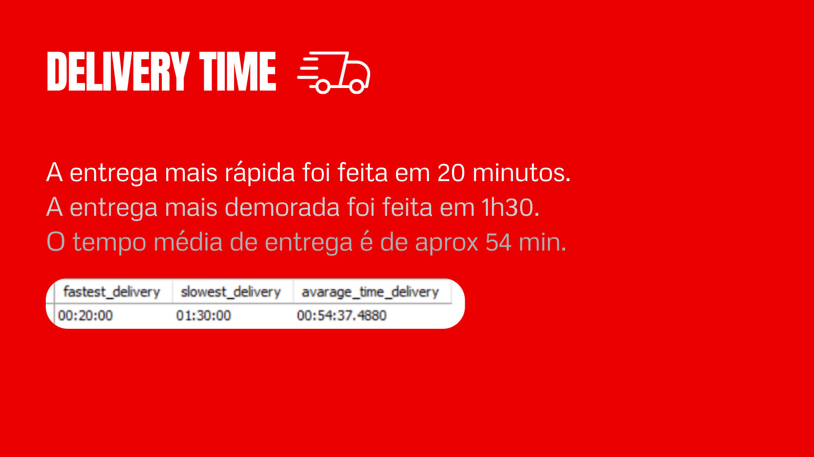
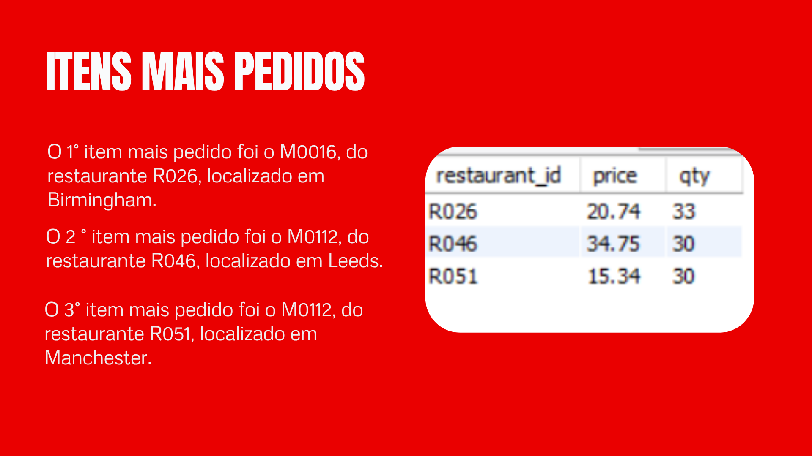
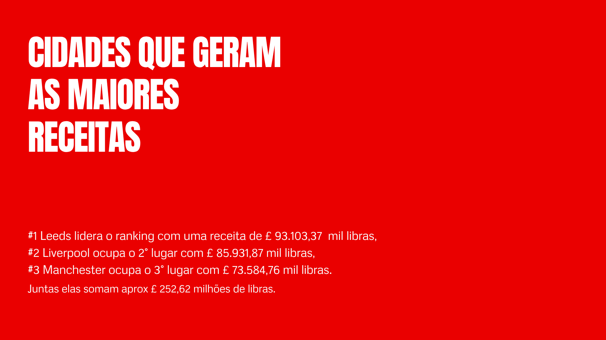
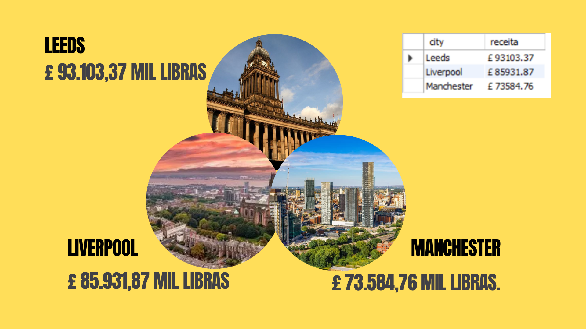
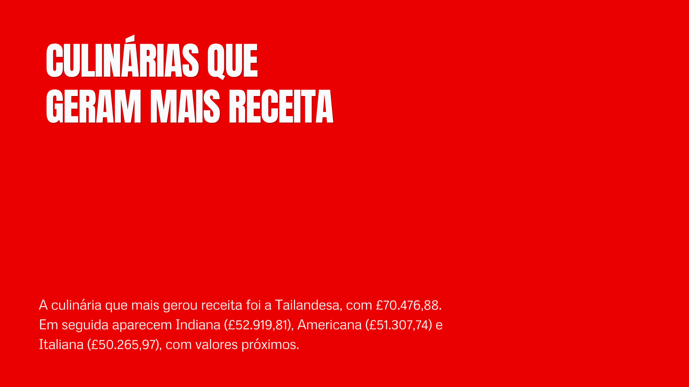
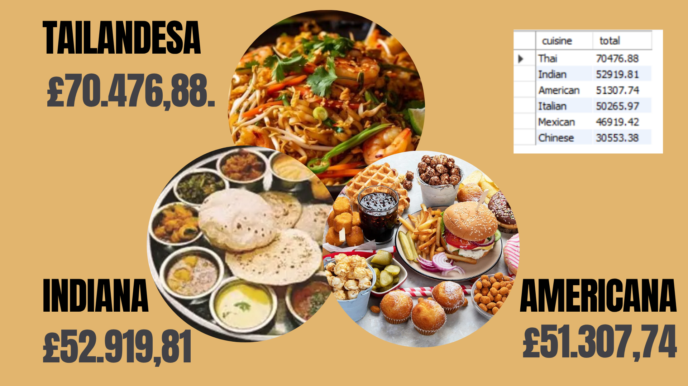
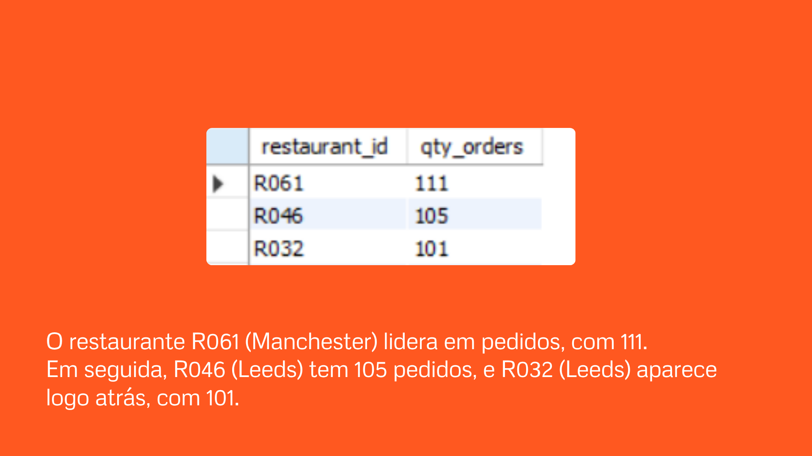
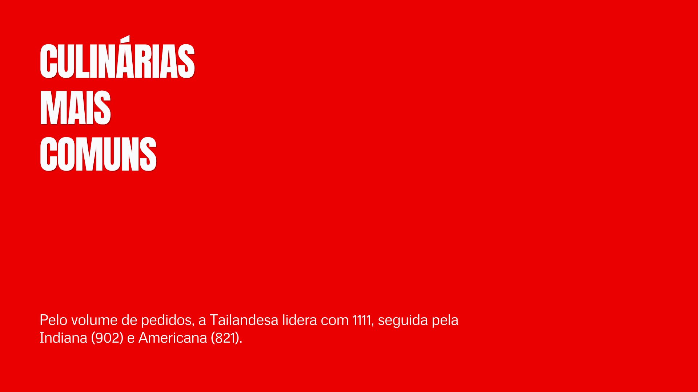
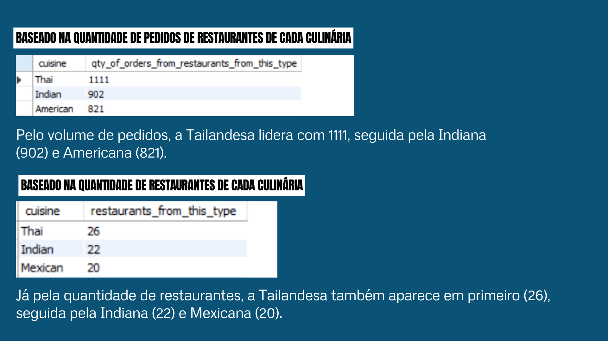

# Análise de uma simulação de uma plataforma de entrega de comidas. 🍝
### 📌 Resumo
Este repositório tem como objetivo a prática de SQL e aplicação de funções avançadas utilizando o dataset SQL Practice Dataset 2 (Medium + Queries), criado por Nudrat Abbas no Kaggle [https://www.kaggle.com/datasets/nudratabbas/sql-practice-dataset-2-medium-queries/discussion/680731]. O conjunto de dados simula uma plataforma de entrega de comidas, com tabelas relacionais como *customers, restaurants, menu_items, orders e order_items*, permitindo explorar consultas em um contexto realista de negócios.

### 🎯 Habilidades Desenvolvidas
A partir de consultas intermediárias, este projeto avança para o domínio de técnicas mais sofisticadas em SQL, incluindo:

Views: criação de visões para consolidar métricas e facilitar análises recorrentes.

Triggers: automação de regras e manutenção da consistência dos dados em tempo real.

Stored Procedures: encapsulamento de consultas complexas para geração de relatórios dinâmicos e reutilizáveis.

Consultas analíticas avançadas: análise de receita por tipo de culinária, gasto médio por cliente, desempenho de restaurantes e padrões de comportamento de usuários.
 
 
### Diagrama Entidade Relacionamento das tabelas:

 

### Busquei responder as perguntas propostas pela criadora do repositório, classificadas em *intermediárias, analíticas e avançadas*:
🟢 Intermediate
1. How many total orders were placed?
2. Which cities have the most customers?
3. Which cuisine types are most common?
4. What are the top restaurants by rating?

🟡 Analytical

5. What is the average delivery time?
6. Which restaurants generate the most revenue?
7. What are the most ordered menu items?
8. Which cities generate the highest revenue?

🔴 Advanced

9. What is the average order value per restaurant?
10. Which customers order most frequently?
11. Which cuisine type generates the most revenue?
12. Which restaurant receives the most orders?
13. What is the average spending per customer?

<h1>Resultados</h1>

  
  
  
  
  
  
  
  
  
  
  
  

